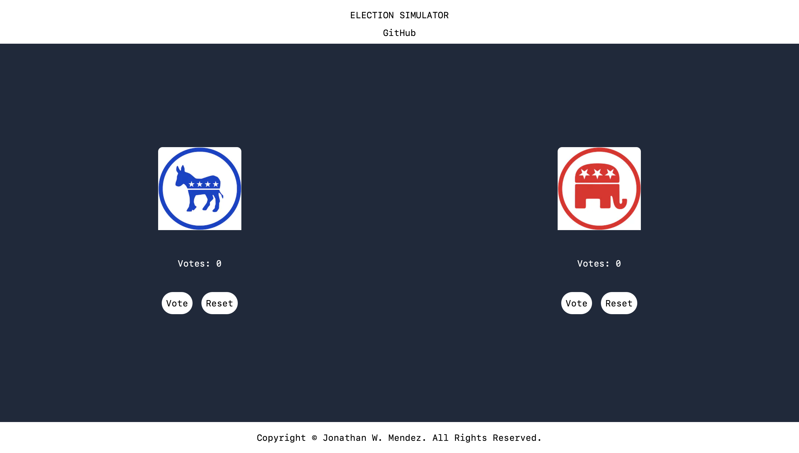

# Election Simulator Website




This website was created for the Chingu Solo Project entry requirement. This website is an election simulator project created using [Next.js](https://nextjs.org/) bootstrapped with [`create-next-app`](https://github.com/vercel/next.js/tree/canary/packages/create-next-app) and is deployed on Vercel. 

**LIVE LINK :** [https://election-simulator-website-gamma.vercel.app](https://election-simulator-website-gamma.vercel.app)

## Features
- A responsive, mobile-friendly design.
- Vote Buttons for counting votes and displays updated counts.
- Reset Buttons for resetting the counts for the votes.
- A link to this repository to make tranversing back and forth easier.


## Getting Started
First, clone this project locally.

Second, install the dependencies:

```bash
npm install
```

Third, run the development server:

```bash
npm run dev
# or
yarn dev
# or
pnpm dev
# or
bun dev
```

Open [http://localhost:3000](http://localhost:3000) with your browser to see the result.

You can start editing the page by modifying `app/page.tsx`. The page auto-updates as you edit the file.

This project uses [`next/font`](https://nextjs.org/docs/basic-features/font-optimization) to automatically optimize and load Inter, a custom Google Font.

## Learn More

To learn more about Next.js, take a look at the following resources:

- [Next.js Documentation](https://nextjs.org/docs) - learn about Next.js features and API.
- [Learn Next.js](https://nextjs.org/learn) - an interactive Next.js tutorial.

You can check out [the Next.js GitHub repository](https://github.com/vercel/next.js/) - your feedback and contributions are welcome!

## Deploy on Vercel

The easiest way to deploy your Next.js app is to use the [Vercel Platform](https://vercel.com/new?utm_medium=default-template&filter=next.js&utm_source=create-next-app&utm_campaign=create-next-app-readme) from the creators of Next.js.

Check out our [Next.js deployment documentation](https://nextjs.org/docs/deployment) for more details.
